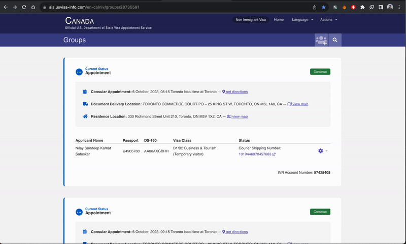

# US Visa Appointment Updates in Canada

## Overview

This repository is dedicated to providing timely updates and information regarding US visa appointment availability for applicants in Canada. It aims to help individuals seeking US visas to stay informed about the latest appointment schedules, changes, and other relevant details.

## Purpose

The primary goal of this repository is to streamline access to information about US visa appointment openings across various consulates in Canada. By keeping track of updates and changes, it assists applicants in planning their visa application process more efficiently.

## Content

The repository includes:

- **Appointment Updates:** Regularly updated information on available US visa appointment slots in different cities and consulates across Canada.
- **Instructions and Tips:** Guidelines, tips, and best practices for scheduling visa appointments, preparing necessary documentation, and navigating the application process.
- **Useful Resources:** Links to official US government visa application portals, consulate websites, and other valuable resources.

## Contribution Guidelines

Contributions to this repository are welcome and encouraged. If you have updates on appointment availability, useful tips, or resources to share, please follow these guidelines:

- **Issues:** Use the issue tracker to report changes in appointment dates or any issues related to visa applications.
- **Pull Requests:** Submit pull requests with updated information or additional resources. Ensure the information is accurate, relevant, and properly formatted.

## How to Use

### Deployment on GCP

Following script allows you to deploy the code on GCP Cloud functions and schedule the updates every 15 minutes.

#### Prerequisites:
1. Have a Google Cloud project created [here](https://cloud.google.com/gcp)
2. Install gcloud CLI [here](https://cloud.google.com/sdk/docs/install)
3. Have your Email, Password and Appontment ID ready 
4. Create a Google chat Room and get the webhook URL [here](https://developers.google.com/chat/how-tos/webhooks#create_a_webhook)

Clone the repo
```
git clone 
```

Deploy on cloud functions
```
gcloud functions deploy scrape-visa-dates \
  --gen2 \
  --region=us-central1 \
  --runtime=nodejs16 \
  --source=. \
  --entry-point=startScraping \
  --set-env-vars email=<YOUR EMAIL>,password=<YOUR PASSWORD>,appointment_id=<YOUR APPOINTMENT ID>,webhook_url=<WEBHOOK URL> \
  --trigger-http
```

Set up Cloud Scheduler for every 15 minutes
```
gcloud scheduler jobs create http us-visa-scheduler \
    --location "us-central1" \
    --schedule "*/15 * * * *" \
    --uri "<CLOUD FUNCTION URL>"
```


### Accessing Updates

1. Visit the repository regularly for the latest updates.
2. Check the provided links and resources for direct access to official portals and consulate websites.
3. Follow the instructions and tips provided to streamline your visa application process.

### Contributing

1. Fork the repository.
2. Make necessary updates or additions.
3. Submit a pull request following the contribution guidelines.

## Disclaimer

Please note that the information provided in this repository is for reference purposes only. While efforts are made to keep the information accurate and up-to-date, visa appointment availability can change rapidly, and it is advisable to double-check information via official channels before making any arrangements or decisions.

## Maintainers

This repository is maintained by [Your Name or Organization](https://github.com/yourusername).

Feel free to reach out to the maintainers for any inquiries, suggestions, or assistance.

---

Feel free to customize this README.md file further by adding specific details, such as update frequency, specific consulate information, or any additional sections relevant to your repository's purpose.